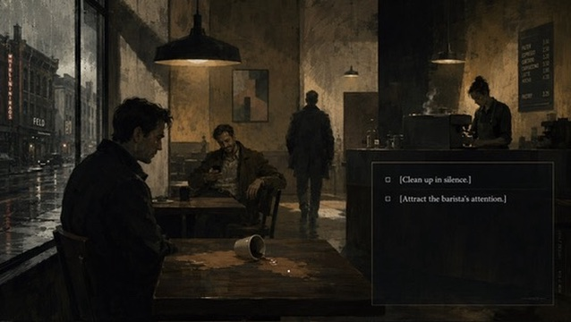

# Visual Style Guide — Just Coffee

> **Status:** Approved ([#40](https://github.com/LionGon/JustCoffee/issues/40) / ISSUE-601).  
> **Locked design source:** [`RULES.md`](../RULES.md) — this document expands §9 for art contributors; it does not override RULES.md.  
> **Café mood reference:** [`assets/cafe-scene.png`](../assets/cafe-scene.png)  
> **Maintenance:** Review at each **M5** milestone; art issues ISSUE-602+ depend on this guide.

### What this guide is for (Cursor / art agents)

This document is the **actionable art brief** for generating assets without reading all of `RULES.md`: locked style name and anti-references, per-district cycle tables, apartment decay states, Dorian Phase 1 vs Reflection Mode rules, NPC visual grammar, HUD safe zones, export naming, and marionette-only constraints. When in doubt, RULES.md wins.

---

## 1. Art direction

### Name (locked)

**Urban Grunge Expressionism** — do not rename.

### Reference hybrid

| Reference | What we take |
|---|---|
| **Kentucky Route Zero** | Geometric silhouettes, dreamlike negative space, theatrical framing |
| **Disco Elysium** | Dense painted texture, mental states externalized in the world |
| **Edward Hopper** | Urban isolation — figures alone in large, lit spaces |

**Tone:** Darker and more urban than either KRZ or Disco Elysium. Rain, concrete, lamplight, exhaustion.

### Anti-references (do not emulate)

| Avoid | Why |
|---|---|
| Cozy café / hygge aesthetics | Sanctuary is *illusory* — warmth is bait, not comfort |
| Whimsical floating geometry (KRZ-lite) | Undercuts the urban grit and bodily threat |
| Cartoon villains, sneering faces, obvious “bad guy” silhouettes | Hostile NPCs are `HOSTILE_LATENT` — deniable, ordinary men |
| Bright indie optimism, pastel palettes | Breaks saturation and trauma arc |
| Glossy mobile-game UI chrome | HUD is minimal and sometimes lies |
| Frame-by-frame walk sprite sheets | Marionette rigging only (§6) |
| Painted duplicate backgrounds for Reflection Mode | Shader inversion only (§3) |

### Edward Hopper — framing rules

Apply on **every** gameplay background at 1920×1080:

1. **Figure scale** — Protagonist and NPCs occupy ≤ 35% of frame height when standing; environment dominates.
2. **Negative space** — Reserve ≥ 40% of frame as unoccupied wall, sky, rain, or shadow mass.
3. **Light pools** — Single dominant practical (lamp, window, neon) creates a lit island; figure may stand in light or be half in shadow — never evenly lit.
4. **Off-center placement** — Protagonist rarely dead-center; prefer lower-third or lateral third.
5. **Aperture feel** — Mid-distance depth: foreground prop (chair, pole) optional; background softens — not fisheye, not flat poster.
6. **Isolation** — Other figures are separated by table distance, glass, or architectural gap — no cozy clustering.

---

## 2. Café mood reference



Use `assets/cafe-scene.png` as **mood + gameplay placement** reference for Le Café (ISSUE-605):

| Element | Direction |
|---|---|
| Atmosphere | Warm practical lamps vs. cold window rain; wood and worn surfaces — not glossy branding |
| Seating | Protagonist table, Thomas/Kevin adjacent — spill beat (§7) must read as contamination, not slapstick |
| Figures | Separated by table distance; no cozy clustering |
| Mirror | Brass-framed mirror on **back wall** in production art (ISSUE-605). **Off-frame in this PNG is acceptable** — the reference is atmosphere and layout, not mirror placement |
| Menu / signage | Artist discretion — legible ambiance OK; no lore-critical text baked in (localization lives in Dialogic) |

**Visual peak:** Le Café is the **richest, warmest exterior-adjacent scene** in the game at Cycle 1 — the sawtooth releases here before the next cycle opens worse. Every other district aspires to this warmth only to fall short.

Production: `assets/backgrounds/cafe_interior_cycle{n}.png` (+ layers), mirror hotspot on back wall per RULES.md §7.

---

## 3. Color palette — two states

### 3.1 Perceived World (default)

| Role | Direction |
|---|---|
| Base | Warm desaturated ochres, concrete greys, muted blues |
| Contrast | High — dramatic pools of lamplight, deep shadow |
| Framing | Hopper isolation (§1) |
| Saturation | Gameplay-driven shifts (§8); at low saturation the **designed** palette stays as above |

**Exception — Le Seuil (apartment):** warm amber palette; the **only genuinely warm space** in the game (§5). All exterior districts share the ochre/grey/blue vocabulary.

### 3.2 Reflection Mode (Cycle 3+ voluntary; Cycle 4 involuntary)

Thermal **negative inversion** of the same scene:

- Cold light sources → warm
- Warm sources → cold
- Geometry unchanged; **emotional reading** flips entirely

**Locked rule — no painted Reflection variants:** Artists deliver **one master palette** per asset set. Inversion is handled by shader (ISSUE-306). Do **not** ship alternate painted backgrounds for Reflection Mode. Separable layers are OK when needed for inversion passes — not duplicate art direction.

Shader implementation: ISSUE-306 — `reflection_mode.gd` toggles inversion.

---

## 4. Dorian superposition — Phase 1 vs Reflection Mode

> Distinction is **non-negotiable** (RULES.md §4). Confusing these breaks the twist.

| | **Phase 1 — The Anomaly** (Cycles 0–1) | **Reflection Mode** (Cycles 3–4) |
|---|---|---|
| **What** | Reflections are *slightly wrong* | Entire scene thermally inverted |
| **Player control** | Passive observation only | Voluntary click (C3); involuntary (C4) |
| **Dialogue** | Unchanged | Entirely different lines |
| **Threat read** | Unchanged | Inverts |
| **Delivery** | Art + optional shader delay | Shader inversion only |

### Phase 1 surfaces to implement

| Surface | District | Cycle 1 behavior |
|---|---|---|
| Shop windows | L'Artère, La Place | Wrong silhouette proportions; ~0.5 s delayed update (ISSUE-609) |
| Puddles | Le Couloir, L'Artère | Same anomaly — subtler, lower contrast |
| Spoon / metal (if shown) | Le Café | Wrong reflection — **no revelation** |
| Brass mirror | Le Café | Clickable; **no visible anomaly** — description text only (RULES.md §7) |

### Phase 1 anomaly — visual spec (both cues, weighted by district)

| District type | Primary cue | Secondary cue |
|---|---|---|
| **Exterior** (Artère, Couloir, Place) | Silhouette proportions wrong in reflection | ~0.5 s delay before reflection matches pose |
| **Le Café** (mirror) | Neither cue in Cycle 1 — mirror reads normal | Anomaly deferred to Cycles 2–3 Reflection unlock |

**Writing rule:** No NPC mentions gender. Player may miss the anomaly entirely.

---

## 5. Domestic safe space — Le Seuil (apartment)

The apartment is the **only genuinely warm space** (RULES.md §8). Palette: **warm amber, soft** — distinct from all exterior scenes.

### Cycle 0 — full state

Interactive hotspots: coffee mug, plant, vinyl record, phone, window (city below). Morning ritual light.

### Decay by cycle (full table)

The apartment **degrades while [PROTAGONIST] is outside**. He returns to a contaminated interior — he did not cause this directly; the outside world is causing it.

| Object | Cycle 0 | Cycle 1 | Cycle 2 | Cycle 3 | Cycle 4 |
|---|---|---|---|---|---|
| Plant | Healthy | Slightly drooping | Wilting | Dead | Gone |
| Phone — friend's message | *"T'as survécu ? 🙂"* / *"Did you survive? 🙂"* | Same, unanswered | *"Tout va bien ?"* / *"You ok?"* — tone shifted | *"Hey."* — nothing else | No message |
| Vinyl | Plays normally | Plays | Skips on one note | Skips constantly | [PROTAGONIST] doesn't put it on |
| Window light | Warm morning | Same | Harsher, bluer | Cold | [PROTAGONIST] doesn't open the blinds |
| Coffee mug | Chosen freely | Same | Grabbed without looking | [PROTAGONIST] forgets to drink it | Cup found cold, untouched |

### Messages for artists

1. **Contamination:** The exterior poisons the interior between visits — each return home is slightly wrong.
2. **False normalcy:** Each cycle **opens** 0–5 min with a brief, believable morning (sawtooth pattern, RULES.md §2) — decay is visible on return, not always on first wake-up beat.

Assets: ISSUE-602 (Cycle 0), ISSUE-603 (decay variants). Naming: `threshold_apartment_cycle{n}.png` (+ layer exports).

---

## 6. Inter-cycle district progression

Cycles follow a **sawtooth** — not linear descent (RULES.md §2). Each cycle opens briefly “normal,” peaks at Le Café, then the next opening is slightly worse.

### District evolution — cycle by cycle

Geometry stays fixed per district; **palette, clutter, and light harden** each cycle. Use the same base illustration with cycle variant layers where noted.

| District | Cycle 0 | Cycle 1 | Cycle 2 | Cycle 3 | Cycle 4 |
|---|---|---|---|---|---|
| **1 — Le Seuil** | Full amber warmth | Slight decay (§5) | Wilting, bluer window | Cold, dead plant | Abandoned ritual |
| **2 — L'Artère** | Banal commercial exposure | Gaze-shift awareness; Phase 1 window anomaly | Memory-echo graffiti/wear; wetter | Claustrophobic signage; paths feel narrower | Visual “merge” glitches — doubled reflections |
| **3 — Le Couloir** | Tight but passable | Deeper shadow pools | Echo textures on walls | Dead-end visual weight | Involuntary reflection flicker |
| **4 — La Place** | False openness | Phase 1 puddle anomaly | Monument/wall stains | Grocery shuttered (art) | Square feels smaller — vignette-friendly |
| **5 — Le Café** | Not sanctuary yet | **Visual peak** — warm ochre, intact brass, complete piano (audio) | Visible décor decay — stains, dimmer lamps | Claustrophobic framing; mirror active (Reflection) | Decayed warmth; mirror dominates finale |

### Café décor degradation (visible, not systems-only)

| Cycle | Décor state |
|---|---|
| 0 | N/A — café not yet sanctuary |
| 1 | Pristine — reference target (`cafe-scene.png` mood) |
| 2 | Subtle wear: cup rings, lamp dimmer, one chair askew |
| 3 | Narrower perceived space; warmer pools feel strained |
| 4 | Peeling warmth; brass tarnished; environment supports involuntary Reflection cuts |

---

## 7. Saturation progression (visual only)

Saturation is **never shown as UI** (§10). Player reads it through vignette, palette cooling, and dissociation.

| Band | Visual effect |
|---|---|
| Low | Palette as designed |
| Mid | Warm tones cool by ~15–20% |
| High | Near-monochrome; vignette closes to ~60% of screen |
| Dissociation (≥ 0.85) | NPCs → flat silhouettes; camera drift ±3px via shader |

Implementation: `CanvasItemShader` on `ColorRect` in `BackBufferCopy` mode (RULES.md §13). Shaders: ISSUE-301–305.

### Post-Elena — third saturation state (RULES.md §5)

After Elena’s gaze (end of Cycle 0):

| Channel | Effect |
|---|---|
| **Saturation curve** | Alters to a third state — neither anxiety nor safety; `SaturationManager` uses a distinct curve (not documented numerically here) |
| **Palette** | Liminal — desaturated but not icy; amber apartment still reads warmest |
| **Inner monologue UI** | Box hidden or empty — silence is the beat |
| **NPC silhouettes** | Dissociation layers still required; third state may trigger earlier silhouette pass on hostile types |
| **Audio/visual sync** | Three isolated piano notes — optional subtle vignette pulse; no UI fanfare |

Provide **silhouette-friendly NPC layers** in all rigs (ISSUE-304, ISSUE-607).

---

## 8. NPC visual grammar (static / rigged art)

Beyond animation (§9), NPCs read through **light, posture, and line density** — never through villain coding.

### Archetype table

| FSM state | Visual read | Light | Posture | Line work |
|---|---|---|---|---|
| `HOSTILE_LATENT` | Ordinary man; threat deniable | Harsh top/side; face half-shadow | Occupies space; weight forward | Angular, heavier outline |
| `BENEVOLENT` | Elderly shopkeeper, etc. | Warm frontal pool | Open shoulders, softer stance | Rounder forms, fewer hard edges |
| `COMPLICIT` | Marc — neutral-complicit | Flat café practicals | Averted eyes, busy hands | Medium density; neither warm nor cold |
| `SCANNING` / `LOCKED_ON` | Gaze vector active | Catchlight in eyes optional | Head turn toward protagonist | — |

### Anti-patterns — hostile NPCs

| Do not | Do instead |
|---|---|
| Sneers, villain mustaches, monster silhouettes | Banal clothing, forgettable faces |
| Red “danger” lighting | Ordinary street lighting |
| Exaggerated muscle threat poses | Casual lean, hands in pockets, “already decided” stillness |
| Text labels or UI markers over NPCs | Gaze verb descriptions only (hedged text) |

### Dissociation silhouettes (≥ 0.85 saturation)

**Both requirements apply — weighting by district:**

| Context | Silhouette layer | Flat fill |
|---|---|---|
| **Exterior districts** | Mandatory `Silhouette` bone group — hide detail meshes | Single fill ~`#2e2e34`; no facial features |
| **Interiors (Café, Épicerie)** | Same layer structure | Slightly warmer fill ~`#3a3530` — sanctuary NPCs (benevolent) may retain 1 accent line longer |

Export a dedicated silhouette texture/layer per NPC rig. ISSUE-304 implements runtime swap.

NPC rigs: ISSUE-607 (Marc, Thomas, Kevin, Elena).

---

## 9. Character animation — marionette rigging only

**Frame-by-frame sprite walk cycles are prohibited** for character movement (RULES.md §9).

### Why

Skeleton2D / cut-out rigging must feel **slightly mechanical** — social scripts performed, not fully inhabited. Do not smooth this out.

### Locked — props and VFX

| Allowed | Prohibited |
|---|---|
| Shader-driven rain, steam, lamp flicker, UV displacement | Frame-by-frame character animation |
| Particle systems for weather | Pre-rendered video backgrounds |
| Skeleton2D marionette rigs for all characters | Smooth tweened “Disney” walk cycles |
| Static illustrated props | Animated sprite-sheet characters |

### Protagonist animation vocabulary

| State | Motion |
|---|---|
| Idle | Subtle weight shift, breathing |
| Walk | Deliberate, slightly stiff |
| Shoulders-up | Stress micro-animation (mid–high saturation) |
| Freeze | Full stop (dissociation) |
| Head-turn | Gaze interaction response |

Rig template: ISSUE-606. Dark coat, average build, deliberately unremarkable.

### NPC animation rules

| NPC type | Animation |
|---|---|
| Hostile / neutral | **More mechanical** than protagonist |
| Benevolent (e.g. grocery shopkeeper) | Smoother, warmer — **only** visual signal of safety |

---

## 10. Composition & HUD (1920×1080)

Art must leave **legible safe zones** for the fixed HUD (RULES.md §11, ISSUE-408). Do not place critical narrative detail inside reserved bands.

### Safe zone map

```
┌──────────────────────────────────────────────────────────── 1920 ────┐
│                                                                      │
│                    NARRATIVE HOTSPOT ZONE (y: 0–820)                 │
│              Keep focal points & click targets here                  │
│                                                                      │
├──────────────────────────────────────────────────────────────────────┤
│  INNER MONOLOGUE (y: 820–940, x: 360–1560) — center-bottom         │
├──────────────┬───────────────────────────────────┬───────────────────┤
│ VERB BAR     │ INVENTORY BAR                     │ LOCATION + CYCLE  │
│ x: 0–420     │ x: 420–1500                       │ x: 1500–1920      │
│ y: 940–1080  │ y: 960–1080                         │ y: 940–1080       │
└──────────────┴───────────────────────────────────┴───────────────────┘
```

Margins are **minimum clears** — atmosphere (floor, blur) may extend into bands; **no irreplaceable faces, hands, or hotspot-only objects** in HUD rectangles.

### Narrative hotspots to protect (by district)

| District | Hotspots — keep clear of HUD overlap |
|---|---|
| **Le Seuil** | Mug, plant, vinyl, phone, window |
| **L'Artère** | Shop-window reflection (Phase 1), storefront paths, bus shelter (micro-sanctuary) |
| **Le Couloir** | Alley mouth, puddle reflections, route choice |
| **La Place** | Open sightlines, grocery door (sanctuary), bench/shelter |
| **Le Café** | Protagonist table, spill zone, Thomas/Kevin table, Marc counter, **brass mirror (back wall)** |

### What the UI never shows

Do not design art expecting these UI elements — they **will not exist**:

- Saturation bar, number, or icon
- “Correct path” markers in safety-mapping puzzles
- Moral judgment indicators
- Quest markers or objectives

### What the UI always shows

Verb bar (bottom left), inventory (bottom center), location + cycle (bottom right), inner monologue (center bottom). The outfit screen **lies** about discretion (Cycle 0–1) — art supports a plausible wardrobe UI, not actual protection.

---

## 11. Backgrounds and ambient motion

**No video files. No pre-rendered character animation on backgrounds.**

| Effect | Technique |
|---|---|
| Rain | Particle shader |
| Steam | Noise-based UV displacement |
| Ambient life | Subtle sine-wave UV displacement |
| Lamp flicker | Shader-driven (not keyframed) |

**Performance:** Saturation and vignette via `CanvasItemShader` on a `ColorRect` in `BackBufferCopy` mode (RULES.md §13). Shaders: ISSUE-301–305.

---

## 12. Technical pipeline & delivery

### Shader / Godot constraints

- All background motion: `assets/shaders/` — no keyframed texture sequences.
- Reflection inversion: single master art + ISSUE-306 shader — no duplicate PNG sets.
- Dissociation drift: camera ±3px via shader parameter — not animated camera node on gameplay scenes.
- Saturation/vignette: `BackBufferCopy` `ColorRect` only — no SubViewport post unless explicitly approved.

### Background export format (by district)

| District | Format | Notes |
|---|---|---|
| **Le Seuil** | Layered PNG + flat composite | Separate layers: plant, window light, phone screen, mug |
| **Le Café** | Layered PNG + flat composite | Mirror, tables, counter separable for hotspot polish |
| **L'Artère, Couloir, Place** | Flat 1920×1080 PNG | Shader hooks for rain/flicker; optional parallax layers if performance allows |
| **Micro-sanctuaries** | Flat or 2-layer | Bus shelter minimum (ISSUE-608) |

### Naming convention

```
assets/backgrounds/{district}_{variant}_cycle{n}.png
assets/backgrounds/layers/{district}_{element}_cycle{n}.png
assets/characters/{name}/{name}_rig.tscn
assets/characters/{name}/layers/{name}_{part}.png
assets/shaders/{effect}.gdshader
```

| District key | Folder name |
|---|---|
| Le Seuil | `threshold` |
| L'Artère | `artery` |
| Le Couloir | `corridor` |
| La Place | `square` |
| Le Café | `cafe` |

Characters: Godot 4 `Skeleton2D` rigs; named bones for head / shoulders. Narrative text in Dialogic — not baked into textures unless artist chooses ambient signage (§2).

---

## 13. District visual identity (summary)

| # | District | FR | Visual note |
|---|---|---|---|
| 1 | Le Seuil | Apartment | Warm amber; degrades across cycles (§5) |
| 2 | L'Artère | Commercial street | Maximum exposure, storefront glare |
| 3 | Le Couloir | Alley | Narrow, vulnerable geometry |
| 4 | La Place | Open square | False decompression — wide, exposed |
| 5 | Le Café | Sanctuary illusion | Visual peak Cycle 1 (§2, §6) |

Full narrative table: RULES.md §2.

---

## 14. Implementation priority (issue #40)

| Priority | Topic | Issues |
|---|---|---|
| **P1** | Dorian Phase 1 vs Reflection Mode | #40, ISSUE-306, ISSUE-609 |
| **P2** | Apartment / degradation | ISSUE-602, ISSUE-603 |
| **P2** | Cycles / sawtooth districts | ISSUE-604, ISSUE-605 |
| **P3** | NPC visual grammar | ISSUE-607, ISSUE-304 |
| **P3** | HUD safe zones | ISSUE-408 |
| **P3** | Café / mirror | ISSUE-605 |
| **P3** | Post-Elena third state | SaturationManager, ISSUE-404 |

---

## 15. Asset delivery checklist

- [ ] Backgrounds at 1920×1080 with HUD safe zones (§10)
- [ ] Characters as Godot 4 `Skeleton2D` rigs; named bones for head / shoulders
- [ ] Layers separable for reflection-mode inversion where needed — **not** duplicate painted Reflection sets
- [ ] Hostile NPC variants include flat silhouette pass (dissociation state)
- [ ] No walk-cycle sprite sheets
- [ ] Phase 1 reflection anomalies on listed surfaces (§4)
- [ ] Apartment cycle variants per decay table (§5)
- [ ] Café cycle décor degradation (§6)
- [ ] File naming under `assets/backgrounds/`, `assets/characters/` per §12

---

## 16. Approval

| Item | Owner | Status |
|---|---|---|
| This document | Developer | ☑ Approved |
| Café reference alignment | Developer | ☑ Approved |
| Marionette-only rule | RULES.md §9 | Locked — non-negotiable |
| Urban Grunge Expressionism | RULES.md §9 | Locked — non-negotiable |
| Reflection shader-only | ISSUE-306 | Locked — non-negotiable |

Closes acceptance on GitHub issue #40. Art issues ISSUE-602+ may proceed.
